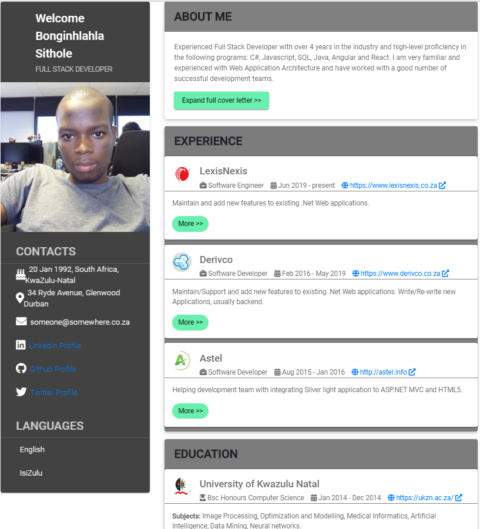

# my-resume

Demo https://sitholewb.github.io/my-resume/

# How to use
This my-resume is written in Angular 10, you need to have environment for this Angular version ready or follow the setup instruction on https://angular.io/guide/setup-local#prerequisites
 - git clone https://github.com/SitholeWB/my-resume.git
 - Go to the cloned directory (e.g. ``cd my-resume/``).
 - Run ``npm install``
 - Run ``ng serve --open``
 
 More templates to be added.
